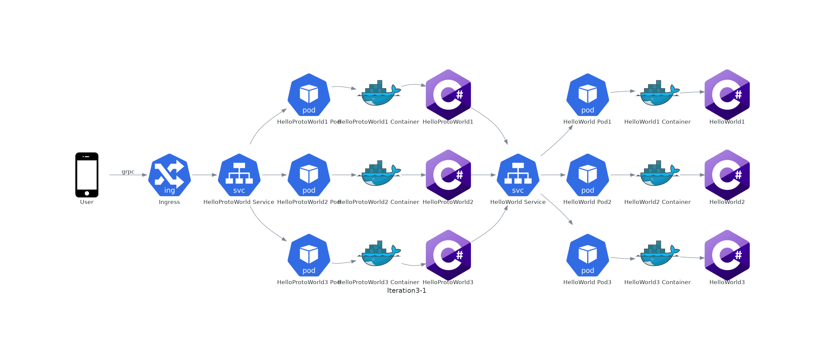
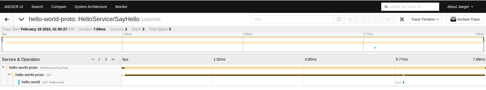
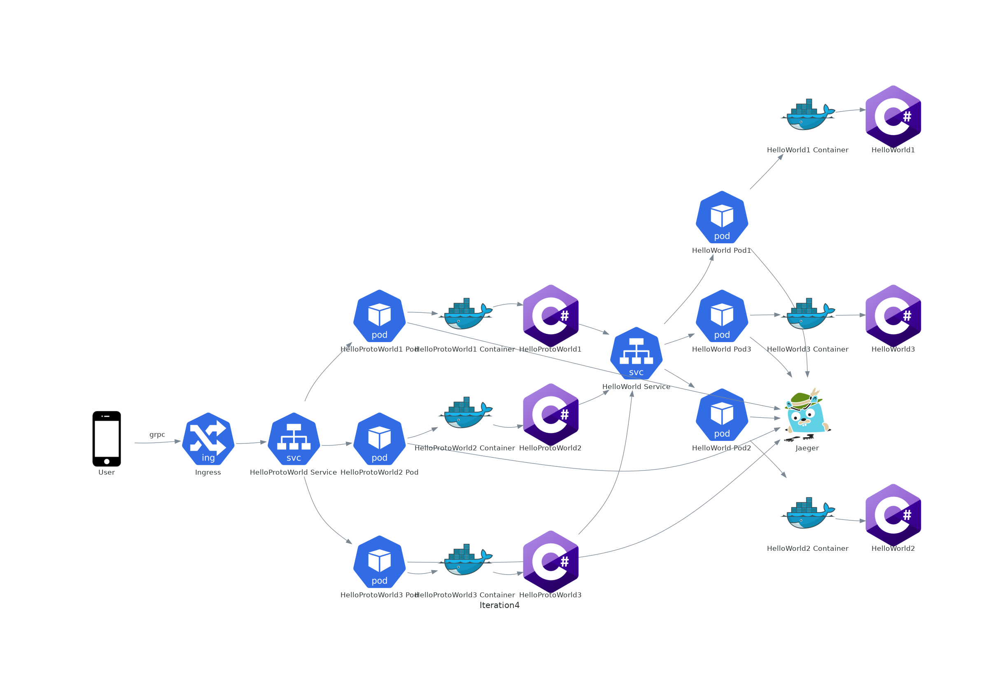

# Intro

На часах 2024 год, пришло время писать микросервисный Real World Helloworld. Он будет в какой-то мере близок к real world, но не слишком, потому что реальность всегда страшнее наших фантазий. Все это вдохновлено [JavaEE Hello world Enterprise edition](https://github.com/Hello-World-EE/Java-Hello-World-Enterprise-Edition/tree/master) и прочими подобными юморесками. Все имена и события вымышлены, любые совпадения случайны, мнение автора может не совпадать с его позицией.

По ходу повествования будем рисовать архитектурные диаграммы (с помощью [diagrams](https://diagrams.mingrammer.com/)) и нагружать сервис, с помощью [k6](https://k6.io/). 

# Iteration -1

Начнем с самого приложения. Язык я возьму C#, потому что я на нем пишу, но это незначительная деталь. Приложение у нас будет микросервисом с одним GET endpoint-ом, который будет возвращать строку "Hello, World!".

```csharp
var builder = WebApplication.CreateBuilder(args);
var app = builder.Build();
builder.Logging.ClearProviders(); // disable logging
app.MapGet("/hello-world", () => "Hello World!");
app.Run();
```

Архитектурная диаграмма


Запускается сервис с помощью

```shell
ASPNETCORE_URLS=http://::5080 dotnet run --project ./src/HelloWorld/HelloWorld.csproj --configuration Release
```

Нагрузим наш сервис c помощью скрипта k6
    
```javascript
import http from 'k6/http';
export const options = {
  vus: 500,
  iterations: 10000,
};
export default function () {
  http.get('http://localhost:5080/hello-world');
}
```
Запустим нагрузочный тест
```shell
k6 --vus 100 --iterations 5000 run ./load/load-test.js
```

Результаты для моей конфигурации

| Metric | Value |
| --- | --- |
|RPS| 28983.928756/s |
|Avg| 15ms |
|Max| 135.4ms |
|Min| 126.9µs |
|Med| 9.32ms |
|95%| 47.88ms |
|90%| 35.53ms |

# Iteration 0

В этой итерации займемся немного деплоем. Некрасиво запускать приложение как мы делали до этого, для этого на сервер надо будет поставить dotnet 8, давайте запакуем приложение в docker контейнер. 

```Dockerfile
FROM mcr.microsoft.com/dotnet/aspnet:8.0 AS base
WORKDIR /app
EXPOSE 5080

FROM mcr.microsoft.com/dotnet/sdk:8.0 AS build
WORKDIR /src

# copy csproj and restore as distinct layer
COPY HelloWorld.csproj .
RUN dotnet restore HelloWorld.csproj

# copy everything else and build the app
COPY . .
RUN dotnet build HelloWorld.csproj --no-restore -c Release -o /app/build

# publish the app
FROM build AS publish
RUN dotnet publish HelloWorld.csproj --no-restore -c Release -o /app/publish

# final image without skd and build dependencies
FROM base AS final
WORKDIR /app
COPY --from=publish /app/publish .
ENTRYPOINT ["dotnet", "HelloWorld.dll"]
```

Запуск приложения у нас немного изменится, потому что надо вначале собрать контейнер, а потом запустить.
    
```shell
# Build application
docker build -t real-world-hello-world ./src/HelloWorld

# Run application
docker run --rm -it -p 5080:5080 -e ASPNETCORE_URLS=http://::5080 real-world-hello-world
```

Архитектурная диаграмма


Нагрузим наше приложение

| Metric | Value |
| --- | --- |
|RPS| 24617.915489/s |
|Avg| 18.1ms |
|Max| 123.4ms |
|Min| 429.67µs |
|Med| 15.41ms |
|95%| 42.17ms  |
|90%| 25.61ms |

# Iteration 1

Микросервисов много не бывает, пришло время добавить еще один. Проблема первого микросервиса, что он возвращает строку, а нам нужно например возвращать json. Давайте добавим второй микросервис HelloJsonWorld, который будет запаковывать ответ первого микросервиса в json. Я добавил немного синглтонной магии, потому что наивная реализация уничтожала производительность совсем беспощадно.

```csharp
using Microsoft.Extensions.Options;

var builder = WebApplication.CreateBuilder(args);
// Register the configuration section
var helloWorldSection = builder.Configuration.GetSection("HelloWorld");
builder.Services.Configure<HelloWorldOptions>(helloWorldSection);
// Add HttpClient to connect to HelloWorld service
builder.Services.AddSingleton<HelloWorldClient>();
builder.Logging.ClearProviders(); // disable logging
var app = builder.Build();
app.MapGet("/hello-json-world", async (HelloWorldClient client) => new
{
    Result = await client.GetHelloWorld()
});
app.Run();

class HelloWorldOptions
{
    public string BaseUrl { get; set; } = string.Empty;
}

class HelloWorldClient
{
    private readonly HttpClient _client;
    public HelloWorldClient(IOptions<HelloWorldOptions> options)
    {
        var socketHandler = new SocketsHttpHandler
        {
            PooledConnectionLifetime = TimeSpan.FromMinutes(15)
        };
        _client = new HttpClient(socketHandler)
        {
            BaseAddress = new Uri(options.Value.BaseUrl)
        };
    }
    public async Task<string> GetHelloWorld()
    {
        var response = await _client.GetAsync("/hello-world");
        return await response.Content.ReadAsStringAsync();
    }
}
```

Поскольку у нас теперь два микросервиса, нам надо их оркестрировать, для этого мы будем использовать docker-compose, ответственно по сборке контейнеров отдадим тоже ему.

```yaml
version: '3.4'

services:
  hello-world:
    build:
      context: ../src/HelloWorld
      dockerfile: Dockerfile
    environment:
      - ASPNETCORE_URLS=http://+:5080
  hello-json-world:
    build:
      context: ../src/HelloJsonWorld
      dockerfile: Dockerfile
    ports:
      - "5090:5090"
    environment:
      - ASPNETCORE_URLS=http://+:5090
      - HelloWorld__BaseUrl=http://hello-world:5080
    depends_on:
      - hello-world
```

Запуск приложения у нас теперь будет таким

```shell
# Build application
docker compose -f ./iac/docker-compose.yaml build 

# Run application
docker compose -f ./iac/docker-compose.yaml up 
```

Архитектурная диаграмма


Нагрузим наше приложение

| Metric | Value |
| --- | --- |
|RPS| 19692.118609/s |
|Avg| 22.61ms |
|Max| 112.71ms |
|Min| 4.49ms |
|Med| 20.68ms |
|95%| 35.66ms  |
|90%| 32.32ms |
|Data received| 1.8 MB |
|Data sent| 960 kB |

# Iteration 2

Сейчас нам надо решить проблему экономии траффика, потому что json добавляет много лишних символов, который влетит нам в копеечку в облачном окружении. Давайте переделаем наш HelloJsonWorld в HelloProtoWorld, добавили в него grpc, чтобы мы использовали бинарный протокол.

Proto файл

```proto
syntax = "proto3";
import "google/protobuf/empty.proto";

service HelloService {
  rpc SayHello (google.protobuf.Empty) returns (HelloReply);
}

message HelloReply {
  string result = 1;
}
```

Код самого сервиса

```csharp
using Grpc.Core;
using Microsoft.Extensions.Options;

var builder = WebApplication.CreateBuilder(args);
// Register the configuration section
var helloWorldSection = builder.Configuration.GetSection("HelloWorld");
builder.Services.Configure<HelloWorldOptions>(helloWorldSection);
// Add HttpClient to connect to HelloWorld service
builder.Services.AddSingleton<HelloWorldClient>();
// Add gRPC service
builder.Services.AddGrpc();
builder.Logging.ClearProviders(); // disable logging
var app = builder.Build();
app.MapGrpcService<GrpcService>();
app.Run();

class HelloWorldOptions
{
    public string BaseUrl { get; set; } = string.Empty;
}

class HelloWorldClient
{
    private readonly HttpClient _client;
    public HelloWorldClient(IOptions<HelloWorldOptions> options)
    {
        var socketHandler = new SocketsHttpHandler
        {
            PooledConnectionLifetime = TimeSpan.FromMinutes(15)
        };
        _client = new HttpClient(socketHandler)
        {
            BaseAddress = new Uri(options.Value.BaseUrl)
        };
    }
    public async Task<string> GetHelloWorld()
    {
        var response = await _client.GetAsync("/hello-world");
        return await response.Content.ReadAsStringAsync();
    }
}

class GrpcService : HelloService.HelloServiceBase
{
    private readonly HelloWorldClient _client;
    public GrpcService(HelloWorldClient client)
    {
        _client = client;
    }

    public async override Task<HelloReply> SayHello(
        Google.Protobuf.WellKnownTypes.Empty _,
        ServerCallContext context)
    {
        return new HelloReply
        {
            Result = await _client.GetHelloWorld()
        };
    }
}

Теперь нам надо сгенерировать сертификаты для HTTP/2, чтобы наш gRPC работал. Для этого нам надо сгенерировать сертификаты и добавить их в контейнер.
Скрипт для генерации сертификата возьмем у [Microsoft](https://learn.microsoft.com/en-us/dotnet/core/additional-tools/self-signed-certificates-guide#with-openssl).

Docker compose файл теперь изменится

```yaml
version: '3.4'

services:
  hello-world:
    build:
      context: ../src/HelloWorld
      dockerfile: Dockerfile
    environment:
      - ASPNETCORE_URLS=http://+:5080
  hello-proto-world:
    build:
      context: ../src/HelloProtoWorld
      dockerfile: Dockerfile
    ports:
      - "5090:5090"
    environment:
      - Kestrel__EndPoints__Https__Url=https://+:5090
      - Kestrel__EndPoints__Https__Certificate__Path=/tls/hello.pfx
      - Kestrel__EndPoints__Https__Certificate__Password=1234
      - HelloWorld__BaseUrl=http://hello-world:5080
    volumes:
      - ./tls:/tls
    depends_on:
      - hello-world
```
Нагрузочный тест тоже придется переписать.

```javascript
import grpc from 'k6/net/grpc';
import { check } from 'k6';
import exec from 'k6/execution';
export const options = {
  vus: 500,
  iterations: 10000,
  //httpDebug: 'full',
  insecureSkipTLSVerify: true,
};
const client = new grpc.Client();
client.load(['definitions'], '../../src/HelloProtoWorld/hello.proto');


export default function () {
  // connect once to reuse connection
  if (exec.vu.iterationInScenario == 0) {
    client.connect('localhost:5090', {});
  }

  const response = client.invoke('HelloService/SayHello', {});

  check(response, {
    'status is OK': (r) => r && r.status === grpc.StatusOK,
  });
}
```

Архитектурная диаграмма


Нагрузим наше приложение

| Metric | Value |
| --- | --- |
|RPS| 9511.721711/s |
|Avg| 29.04ms |
|Max| 227.83ms |
|Min| 4.77ms |
|Med| 25.79ms |
|95%| 55.35ms   |
|90%| 42.37ms |
|Data received| 2.5 MB |
|Data sent| 1.3 MB |

Видно, что сэкономить не получилось, даже наоборот, но наверное если бы отправляли массив чисел с плавающей точкой, то разница была бы заметней.

# Iteration 3

Время сделать глубокий вдох, потому что мы будем нырять в Kubernetes и вынырнем мы не скоро. Все что было до этого - это не серьезно, нам нужно high availability, scalability, service discovery, load balancing, rolling updates и прочие базворды.

Для локального запуска я буду использовать [Minikube 1.32.0](https://minikube.sigs.k8s.io/)

```shell
$ minikube start
$ kubectl get pods -A
NAMESPACE     NAME                               READY   STATUS    RESTARTS      AGE
kube-system   coredns-5dd5756b68-skshs           1/1     Running   0             2m7s
kube-system   etcd-minikube                      1/1     Running   0             2m22s
kube-system   kube-apiserver-minikube            1/1     Running   0             2m22s
kube-system   kube-controller-manager-minikube   1/1     Running   0             2m20s
kube-system   kube-proxy-p7v5j                   1/1     Running   0             2m7s
kube-system   kube-scheduler-minikube            1/1     Running   0             2m22s
kube-system   storage-provisioner                1/1     Running   1 (97s ago)   2m19s
```

Для начала нам надо собрать и затегать наши контейнеры c помощью docker-compose. 

```yaml
...
services:
  hello-world:
    image: real-hello-world:0.0.1
    ...
  hello-proto-world:
    image: real-hello-proto-world:0.0.1
    ...
```

Билдить контейнеры надо внутри  minikube, чтобы они были доступны внутри кластера.

```shell
eval $(minikube docker-env)
docker compose -f ./iac/docker-compose.yaml build
```

Создадим namespace для наших сервисов

```shell
kubectl create namespace hello
```

Теперь надо подготовить deployment.yaml для hello-world сервиса

```yaml
apiVersion: apps/v1
kind: Deployment
metadata:
  name: hello-world-deployment
  labels:
    app: hello-world
spec:
  replicas: 3 # High availability
  selector:
    matchLabels:
      app: hello-world
  template:
    metadata:
      labels:
        app: hello-world
    spec:
      containers:
      - name: hello-world
        image: real-hello-world:0.0.1
        ports:
        - containerPort: 5080
        env:
        - name: ASPNETCORE_URLS
          value: "http://+:5080"
```

Также надо подготовить service.yaml для hello-world

```yaml
apiVersion: v1
kind: Service
metadata:
  name: hello-world-service
spec:
  selector:
    app: hello-world
  ports:
    - protocol: TCP
      port: 80
      targetPort: 5080
```

Теперь надо применить наши файлы

```shell
# apply deployment
kubectl apply -f ./iac/k8s/deployment.yaml -n hello
# apply service
kubectl apply -f ./iac/k8s/service.yaml -n hello
```

Для того чтобы запустить hello-proto-world нам надо сначала создать secret для сертификата

```shell
kubectl create secret generic hello-tls --from-file=hello.pfx=./iac/tls/hello.pfx -n hello
```

Теперь надо подготовить deployment.yaml для hello-proto-world

```yaml
apiVersion: apps/v1
kind: Deployment
metadata:
  name: hello-proto-world-deployment
  labels:
    app: hello-proto-world
spec:
  replicas: 3 # High availability
  selector:
    matchLabels:
      app: hello-proto-world
  template:
    metadata:
      labels:
        app: hello-proto-world
    spec:
      containers:
      - name: hello-proto-world
        image: real-hello-proto-world:0.0.1
        ports:
        - containerPort: 5080
        env:
        - name: Kestrel__EndPoints__Https__Url
          value: "https://+:5090"
        - name: Kestrel__EndPoints__Https__Certificate__Path
          value: "/tls/hello.pfx"
        - name: Kestrel__EndPoints__Https__Certificate__Password
          value: "1234"
        - name: HelloWorld__BaseUrl
          value: "http://hello-world-service.hello.svc.cluster.local:80"
        volumeMounts:
        - name: tls
          mountPath: /tls
          readOnly: true
      volumes:
      - name: tls
        secret:
          secretName: hello-tls
```

И service.yaml для hello-proto-world

```yaml
apiVersion: v1
kind: Service
metadata:
  name: hello-proto-world-service
spec:
  selector:
    app: hello-proto-world
  ports:
    - protocol: TCP
      port: 443
      targetPort: 5090
```

Применим наши файлы

```shell
# hello-world

# apply deployment
kubectl apply -f ./iac/k8s/hello-world/deployment.yaml -n hello
# apply service
kubectl apply -f ./iac/k8s/hello-world/service.yaml -n hello

# hello-proto-world

# apply deployment
kubectl apply -f ./iac/k8s/hello-proto-world/deployment.yaml -n hello
# apply service
kubectl apply -f ./iac/k8s/hello-proto-world/service.yaml -n hello
```

Все должно работать

```shell
$ kubectl get pods -n hello
NAME                                           READY   STATUS    RESTARTS   AGE
hello-proto-world-deployment-cd5f68868-2tvxd   1/1     Running   0          32s
hello-proto-world-deployment-cd5f68868-4qf6d   1/1     Running   0          32s
hello-proto-world-deployment-cd5f68868-8ddns   1/1     Running   0          32s
hello-world-deployment-7fdf4c4d47-5l6pf        1/1     Running   0          10m
hello-world-deployment-7fdf4c4d47-q2nvz        1/1     Running   0          10m
hello-world-deployment-7fdf4c4d47-qp9vq        1/1     Running   0          10m
```

Чтобы протестировать сервисы нужно получить доступ к hello-proto-world сервису извне, для этого создадим ingress.yaml

```yaml
apiVersion: networking.k8s.io/v1
kind: Ingress
metadata:
  name: hello-ingress
  annotations:
    nginx.ingress.kubernetes.io/ssl-redirect: "true"
    nginx.ingress.kubernetes.io/backend-protocol: "GRPCS"
spec:
  ingressClassName: nginx
  rules:
  - host: hello
    http:
      paths:
      - path: /
        pathType: Prefix
        backend:
          service:
            name: hello-proto-world-service
            port:
              number: 443
  tls:
  - secretName: hello-ingress-tls
    hosts:
      - hello
```

Нужно включить ingress addon в minikube и создать секрет для tls, потом применить ingress.yaml

```shell
minikube addons enable ingress
kubectl create secret tls hello-ingress-tls --key=./iac/tls/hello.key --cert=./iac/tls/hello.crt -n hello
# ingress
kubectl apply -f ./iac/k8s/ingress.yaml -n hello
```

Получилась следующая архитектурная диаграмма


Но на самом деле с учетом трех реплик для каждого сервиса, она выглядит так




Чтобы протестировать сервис нужно добавить запись в hosts файл

```shell
echo "$(minikube ip) hello" | sudo tee -a /etc/hosts
```

| Metric | Value |
| --- | --- |
|RPS| 9518.067672/s |
|Avg| 29.88ms |
|Max| 288.3ms |
|Min| 7.17ms |
|Med| 25.62ms |
|95%| 56.57ms   |
|90%| 44.77ms |

# Iteration 4

На самом деле  сильно не хватает мониторинга, если открыть minikube dashboard.

```
minikube addons enable metrics-server
minikube dashboard
```

Мы не увидим ни  логов, ни хелсчеков.


Давайте добавим структурное логирование, трейсинг и хелсчеки. Для этого нам надо добавить в наши сервисы следующие строки.

Для структурного логгирования я буду использовать [Serilog](https://serilog.net/)  и [Serilog.Sinks.RawConsole](https://github.com/epeshk/serilog-sinks-rawconsole), [Serilog.Formatting.Compact.Utf8](https://www.nuget.org/packages/Serilog.Formatting.Compact.Utf8/) и  [Serilog.Sinks.Background](https://www.nuget.org/packages/Serilog.Sinks.Background/) by [epeshk](https://t.me/epeshkblog)

```csharp
...
using Serilog;
using Serilog.Events;
using Serilog.Formatting.Compact.Utf8;

Log.Logger = new LoggerConfiguration()
      .MinimumLevel.Override("Microsoft.AspNetCore", LogEventLevel.Warning)
      .WriteTo.Background(a => a.RawConsole(new CompactUtf8JsonFormatter()))
      .CreateLogger();

try 
{
  ...
  builder.Host.UseSerilog(); // Use Serilog
  ...
  var app = builder.Build();
  app.UseSerilogRequestLogging(); // Use Serilog Request Logging
  ...
  app.Run();
}
catch (Exception ex)
{
    Log.Fatal(ex, "Application terminated unexpectedly");
}
finally 
{
    await Log.CloseAndFlushAsync();
}
```

Добавим healthchecks 

```csharp
...
builder.Host.UseSerilog(); // Use Serilog
builder.Services.AddHealthChecks();
...
var app = builder.Build();
app.UseHealthChecks("/health");
...
```

Для hello-proto-world добавим probe для hello world

```csharp

builder.Services.AddHealthChecks()
    .AddCheck<HelloWorldHealthCheck>("hello-world");
...
class HelloWorldHealthCheck : IHealthCheck
{
    private readonly IOptions<HelloWorldOptions> _options;
    public HelloWorldHealthCheck(IOptions<HelloWorldOptions> options)
    {
        _options = options;
    }

    public async Task<HealthCheckResult> CheckHealthAsync(
        HealthCheckContext context, 
        CancellationToken cancellationToken = default)
    {
        try 
        {
            var client = new HelloWorldClient(_options);
            var response = await client.GetHelloWorld();
            if (response == "Hello World!")
            {
                return HealthCheckResult.Healthy("A healthy result.");
            }
            return HealthCheckResult.Unhealthy("An unhealthy result.");
        }
        catch (Exception ex)
        {
            return new HealthCheckResult(
                context.Registration.FailureStatus, 
                "An unhealthy result.", 
                ex);
        }
    }
}
```

Включим хелсчеки в нашем deployment.yaml

```yaml
...
livenessProbe:
  httpGet:
    path: /health
    port: 5080
  initialDelaySeconds: 10
  periodSeconds: 15
  failureThreshold: 5
readinessProbe:
  httpGet:
    path: /health
    port: 5080
  initialDelaySeconds: 3
  periodSeconds: 15
  failureThreshold: 5
...
```

Измерим как логирование и хелсчеки повлияли на производительность

| Metric | Value |
| --- | --- |
|RPS| 6086.363055/s |
|Avg| 56.63ms |
|Max| 794.49ms |
|Min| 6.69ms |
|Med| 47.94ms |
|95%| 99.64ms   |
|90%| 83.81ms |

Добавим трейсинг, для этого я буду использовать [OpenTelemetry](https://opentelemetry.io/)

```csharp
...
builder.Services.AddOpenTelemetry()
        .WithMetrics(builder =>
        {
            builder.AddPrometheusExporter();

            builder.AddMeter("Microsoft.AspNetCore.Hosting",
                            "Microsoft.AspNetCore.Server.Kestrel");
            builder.AddView("http.server.request.duration",
                new ExplicitBucketHistogramConfiguration
                {
                    Boundaries = new double[] { 0, 0.005, 0.01, 0.025, 0.05,
                        0.075, 0.1, 0.25, 0.5, 0.75, 1, 2.5, 5, 7.5, 10 }
                });
        })
        .WithTracing(b => b
            .SetResourceBuilder(ResourceBuilder.CreateDefault().AddService("hello-world"))
            .AddAspNetCoreInstrumentation()
            .AddHttpClientInstrumentation() // only for hello-proto-world
            .AddOtlpExporter()
        );
...
```

Добавим в наш deployment.yaml переменные окружения для hello-proto-world

```yaml
...
  - name: OTEL_EXPORTER_OTLP_ENDPOINT
    value: "http://jaeger-collector.observability.svc.cluster.local:4317"
  - name: OTEL_EXPORTER_OTLP_PROTOCOL
    value: "grpc"
  - name: OTEL_DOTNET_EXPERIMENTAL_ASPNETCORE_ENABLE_GRPC_INSTRUMENTATION # only for hello-proto-world
    value: "true"
...
```

Осталось только запустить jaeger внутри minikube

```shell
kubectl create namespace observability
helm repo add jaegertracing https://jaegertracing.github.io/helm-charts
helm install jaeger jaegertracing/jaeger --values ./iac/k8s/jaeger/jaeger-values.yaml -n observability
```

И мы сможем увидеть трейсы в jaeger



Измерим производительность после добавления трейсинга

| Metric | Value |
| --- | --- |
|RPS| 4910.652244/s |
|Avg| 72.24ms |
|Max| 637.73ms |
|Min| 4.12ms |
|Med| 63.15ms |
|95%| 129.43ms   |
|90%| 110.62ms |

Для смеха можно добавить Jaeger в нашу архитектурную диаграмму




