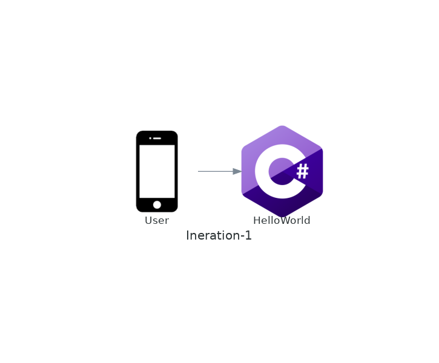
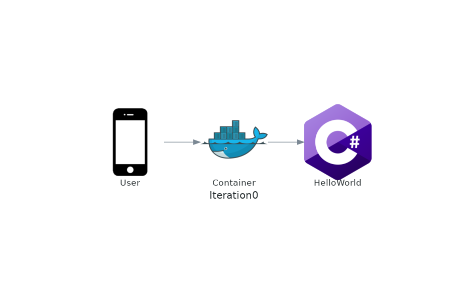

# Intro

На часах 2024 год, пришло время писать микросервисный Real World Helloworld. Он будет в какой-то мере близок к real world, но не слишком, потому что реальность всегда страшнее наших фантазий. Все это вдохновлено [JavaEE Hello world Enterprise edition](https://github.com/Hello-World-EE/Java-Hello-World-Enterprise-Edition/tree/master) и прочими подобными юморесками. Все имена и события вымышлены, любые совпадения случайны, мнение автора может не совпадать с его позицией.

По ходу повествования будем рисовать архитектурные диаграммы (с помощью [diagrams](https://diagrams.mingrammer.com/)) и нагружать сервис, с помощью [k6](https://k6.io/). 

# Iteration -1

Начнем с самого приложения. Язык я возьму C#, потому что я на нем пишу, но это незначительная деталь. Приложение у нас будет микросервисом с одним GET endpoint-ом, который будет возвращать строку "Hello, World!".

```csharp
var builder = WebApplication.CreateBuilder(args);
var app = builder.Build();
builder.Logging.ClearProviders(); // disable logging
app.MapGet("/hello-world", () => "Hello World!");
app.Run();
```

Архитектурная диаграмма


Запускается сервис с помощью

```shell
ASPNETCORE_URLS=http://::5080 dotnet run --project ./src/HelloWorld/HelloWorld.csproj --configuration Release
```

Нагрузим наш сервис c помощью скрипта k6
    
```javascript
import http from 'k6/http';
export const options = {
  vus: 500,
  iterations: 10000,
};
export default function () {
  http.get('http://localhost:5080/hello-world');
}
```
Запустим нагрузочный тест
```shell
k6 --vus 100 --iterations 5000 run ./load/load-test.js
```

Результаты для моей конфигурации

| Metric | Value |
| --- | --- |
|RPS| 28983.928756/s |
|Avg| 15ms |
|Max| 135.4ms |
|Min| 126.9µs |
|Med| 9.32ms |
|95%| 47.88ms |
|90%| 35.53ms |

# Iteration 0

В этой итерации займемся немного деплоем. Некрасиво запускать приложение как мы делали до этого, для этого на сервер надо будет поставить dotnet 8, давайте запакуем приложение в docker контейнер. 

```Dockerfile
FROM mcr.microsoft.com/dotnet/aspnet:8.0 AS base
WORKDIR /app
EXPOSE 5080

FROM mcr.microsoft.com/dotnet/sdk:8.0 AS build
WORKDIR /src

# copy csproj and restore as distinct layer
COPY HelloWorld.csproj .
RUN dotnet restore HelloWorld.csproj

# copy everything else and build the app
COPY . .
RUN dotnet build HelloWorld.csproj --no-restore -c Release -o /app/build

# publish the app
FROM build AS publish
RUN dotnet publish HelloWorld.csproj --no-restore -c Release -o /app/publish

# final image without skd and build dependencies
FROM base AS final
WORKDIR /app
COPY --from=publish /app/publish .
ENTRYPOINT ["dotnet", "HelloWorld.dll"]
```

Запуск приложения у нас немного изменится, потому что надо вначале собрать контейнер, а потом запустить.
    
```shell
# Build application
docker build -t real-world-hello-world ./src/HelloWorld

# Run application
docker run --rm -it -p 5080:5080 -e ASPNETCORE_URLS=http://::5080 real-world-hello-world
```

Архитектурная диаграмма



Нагрузим наше приложение

| Metric | Value |
| --- | --- |
|RPS| 24617.915489/s |
|Avg| 18.1ms |
|Max| 123.4ms |
|Min| 429.67µs |
|Med| 15.41ms |
|95%| 42.17ms  |
|90%| 25.61ms |

# Iteration 1

Микросервисов много не бывает, пришло время добавить еще один. Проблема первого микросервиса, что он возвращает строку, а нам нужно например возвращать json. Давайте добавим второй микросервис HelloJsonWorld, который будет запаковывать ответ первого микросервиса в json. Я добавил немного синглтонной магии, потому что наивная реализация уничтожала производительность совсем беспощадно.

```csharp
using Microsoft.Extensions.Options;

var builder = WebApplication.CreateBuilder(args);
// Register the configuration section
var helloWorldSection = builder.Configuration.GetSection("HelloWorld");
builder.Services.Configure<HelloWorldOptions>(helloWorldSection);
// Add HttpClient to connect to HelloWorld service
builder.Services.AddSingleton<HelloWorldClient>();
builder.Logging.ClearProviders(); // disable logging
var app = builder.Build();
app.MapGet("/hello-json-world", async (HelloWorldClient client) => new
{
    Result = await client.GetHelloWorld()
});
app.Run();

class HelloWorldOptions
{
    public string BaseUrl { get; set; } = string.Empty;
}

class HelloWorldClient
{
    private readonly HttpClient _client;
    public HelloWorldClient(IOptions<HelloWorldOptions> options)
    {
        var socketHandler = new SocketsHttpHandler
        {
            PooledConnectionLifetime = TimeSpan.FromMinutes(15)
        };
        _client = new HttpClient(socketHandler)
        {
            BaseAddress = new Uri(options.Value.BaseUrl)
        };
    }
    public async Task<string> GetHelloWorld()
    {
        var response = await _client.GetAsync("/hello-world");
        return await response.Content.ReadAsStringAsync();
    }
}
```

Поскольку у нас теперь два микросервиса, нам надо их оркестрировать, для этого мы будем использовать docker-compose, ответственно по сборке контейнеров отдадим тоже ему.

```yaml
version: '3.4'

services:
  hello-world:
    build:
      context: ../src/HelloWorld
      dockerfile: Dockerfile
    environment:
      - ASPNETCORE_URLS=http://+:5080
  hello-json-world:
    build:
      context: ../src/HelloJsonWorld
      dockerfile: Dockerfile
    ports:
      - "5090:5090"
    environment:
      - ASPNETCORE_URLS=http://+:5090
      - HelloWorld__BaseUrl=http://hello-world:5080
    depends_on:
      - hello-world
```

Запуск приложения у нас теперь будет таким

```shell
# Build application
docker compose -f ./iac/docker-compose.yaml build 

# Run application
docker compose -f ./iac/docker-compose.yaml up 
```

Архитектурная диаграмма


Нагрузим наше приложение

| Metric | Value |
| --- | --- |
|RPS| 19692.118609/s |
|Avg| 22.61ms |
|Max| 112.71ms |
|Min| 4.49ms |
|Med| 20.68ms |
|95%| 35.66ms  |
|90%| 32.32ms |